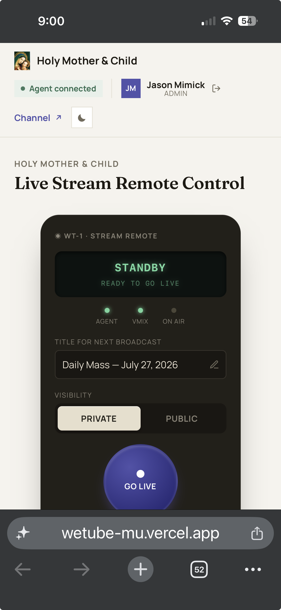

# wetube

**A "big red button" for church livestreaming.** Any authorized volunteer starts and stops the Sunday Mass YouTube livestream from their phone — no software to install, no VPN, nothing to plug in.

<p align="center">
  
</p>

## Why this exists

Before wetube, going live meant someone physically opening YouTube Studio, creating a broadcast, setting the title and visibility, then starting the vMix software on the church PC — every single week, and it only worked if that one specific person was there. wetube collapses all of that into one screen and one button, so any volunteer can do it from a phone.

## How it works

- **Sign in with a passcode** — one shared code for volunteers, a separate one for the owner. The sign-in screen doubles as a quick visual guide to using the remote.
- **Check the lights.** Agent and vMix status show up as simple green/red indicators before you even try to go live.
- **Name it and set visibility.** The title auto-fills sensibly (Sunday Mass vs. Daily Mass, with the date) and is editable for weddings, funerals, or anything else. Visibility defaults to Private and slides to Public when it's the real thing.
- **Press the button.** One tap starts the YouTube broadcast and the church-PC video software together; the same button stops it.
- **Watch it happen.** The live YouTube player shows up right in the app once it's live, so whoever's running it can confirm picture and sound without leaving the page.
- **Auto-shutoff failsafe.** Any broadcast still running after 2 hours stops itself automatically, unless the owner explicitly overrides it for a longer event — so nobody can start it and forget it.

## Architecture

Three pieces, kept deliberately simple:

- **`app/`** — Next.js web app (Vercel). The remote control UI, YouTube Data API integration, passcode auth, and the only thing that touches the database.
- **`agent/`** — a small Node process that runs on the church PC. Polls the web app over HTTPS for start/stop commands and drives vMix's local API. Ships as a single packaged executable — nothing to install, no Node.js required on the church machine, and no database credentials stored there.
- **Turso** (cloud SQLite) holds the state. The church PC only ever makes outbound HTTPS calls to the web app, so there's no networking, port-forwarding, or VPN setup needed at the church.

```
 volunteer's phone           Vercel + Turso           church PC
┌──────────────────┐      ┌──────────────┐      ┌──────────────────┐
│  wetube web app   │ ───▶ │   commands   │ ───▶ │   wetube agent    │
│  (Next.js/Vercel) │ ◀─── │   status     │ ◀─── │  (drives vMix)    │
└──────────────────┘      └──────────────┘      └──────────────────┘
        polls /api/state          ▲          polls /api/agent/poll
                                  │
                          one shared secret,
                          no cloud keys on the church PC
```

## Status

Live and in real use at Holy Mother & Child Parish.

---

*Built for one parish, shared in case it's useful to others running a small livestream on a volunteer crew.*
